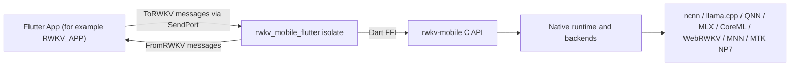

# rwkv_mobile_flutter

[](LICENSE)
[](./docs/README.zh-hans.md)
[](./docs/README.zh-hant.md)
[](./docs/README.ja.md)
[](./docs/README.ko.md)
[](./docs/README.ru.md)

**Bridge Flutter apps to the `rwkv-mobile` inference runtime.**
**A Flutter FFI plugin and runtime orchestration layer for on-device RWKV, multimodal, and speech workloads.**

`rwkv_mobile_flutter` sits between a Flutter app and the native `rwkv-mobile` C++ inference engine. It is not just a thin FFI binding: it also owns the isolate boundary, request/response protocol, model lifecycle, native library loading, and part of the runtime coordination needed by apps such as [RWKV_APP](https://github.com/RWKV-APP/RWKV_APP).

## Why rwkv_mobile_flutter

- **Built for Flutter-native integration:** Expose the native runtime to Dart without forcing app code to manage raw FFI calls directly.
- **Designed for real device workloads:** Keep inference work off the UI isolate and coordinate model loading, generation, vision, audio, and TTS flows in one place.
- **One bridge for multiple backends:** Reuse the same Dart-side protocol across CPU, GPU, and NPU-backed runtimes provided by `rwkv-mobile`.
- **Production-oriented packaging:** Ship prebuilt native libraries for Android, iOS, macOS, Windows, and Linux as part of the plugin.

### Pinned native release

`native-libraries.json` records the RWKV-APP native fork commit, immutable
release tag, archive checksums and installed-file checksums. The legacy-named
`fetch_latest_libraries.sh` and `.ps1` now restore that exact release. They do
not follow an upstream `latest` tag.

Run `python3 tools/fetch_native_libraries.py --verify-only` to verify all
vendored libraries without downloading. Omit `--verify-only` to restore a
changed file; repeat `--platform` to select individual manifest platforms.
Windows and Linux packaging selects only the target architecture's libraries.
Palm is bundled as the optional `palm` CPU backend for external `.mollm` files.

## ✨ Core Features

- **Cross-platform Flutter FFI plugin:** Android, iOS, macOS, Windows, and Linux.
- **Isolate-based runtime bridge:** Run the native inference runtime behind a dedicated Dart isolate.
- **Structured request/response protocol:** `ToRWKV` and `FromRWKV` sealed classes for app-to-runtime messaging.
- **Model lifecycle management:** Load, unload, switch, and inspect multiple models from Flutter.
- **Text generation APIs:** Completion, chat with history, batch inference, stop/resume-style polling, and token counting.
- **Multimodal support:** Vision encoder, adapter-based vision flow, and Whisper-style audio prompt support.
- **Speech support:** SparkTTS model loading, streaming TTS buffers, global tokens, and property-driven speech generation.
- **Runtime diagnostics:** Load progress, prefill/decode speed, logs, SoC/platform detection, and state cache inspection.

## 🧭 Architecture Position

This repository is best understood as the middle layer in a three-part stack:



- **App layer:** product UI, state management, downloads, business logic.
- **This layer:** isolate boundary, protocol, platform library loading, runtime orchestration, Dart-facing API surface.
- **Engine layer:** C++ runtime, backend implementations, native inference, and low-level C API.

## 🚀 Get Started

### Add the dependency

For local development, `RWKV_APP` uses this repository as a path dependency:

```yaml
dependencies:
  rwkv_mobile_flutter:
    path: ../rwkv_mobile_flutter
```

You can do the same in your own Flutter app, or point to the Git repository you maintain internally.

### Start the runtime isolate

```dart
import 'dart:isolate';
import 'dart:ui';

import 'package:rwkv_mobile_flutter/rwkv.dart';

final receivePort = ReceivePort();

receivePort.listen((message) {
  if (message is SendPort) {
    // Save this SendPort and use it to send ToRWKV requests.
  } else {
    // Handle FromRWKV responses here.
  }
});

await RWKVMobile().runIsolate(
  StartOptions(
    sendPort: receivePort.sendPort,
    rootIsolateToken: RootIsolateToken.instance!,
  ),
);
```

### Communicate through typed messages

Frontend isolate and RWKV isolate communicate through `SendPort`:

- Requests: `lib/to_rwkv.dart`
- Responses: `lib/from_rwkv.dart`
- Runtime bridge: `lib/rwkv_mobile_flutter.dart`

Typical app flow:

1. Start the RWKV isolate.
2. Receive the isolate `SendPort`.
3. Send typed requests such as `LoadRWKVModel`, `ChatAsync`, `GenerateAsync`, or `StartTTS`.
4. Consume typed responses such as `LoadModelSteps`, `ResponseBufferContent`, `Speed`, or `TTSStreamingBuffer`.

## 🔌 Protocol Overview

The public Dart-side contract is centered on two sealed hierarchies:

### Frontend to runtime

```dart
sealed class ToRWKV {}
```

Representative request types include:

- `LoadRWKVModel`
- `ReleaseRWKVModel`
- `ChatAsync`
- `ChatBatchAsync`
- `GenerateAsync`
- `GetResponseBufferContent`
- `LoadVisionEncoder`
- `LoadVisionEncoderAndAdapter`
- `LoadWhisperEncoder`
- `StartTTS`
- `SaveRuntimeStateByHistory`

### Runtime to frontend

```dart
sealed class FromRWKV {}
```

Representative response types include:

- `LoadModelSteps`
- `GenerateStart`
- `GenerateStop`
- `ResponseBufferContent`
- `ResponseBatchBufferContent`
- `Speed`
- `EvaluationResults`
- `RuntimeLog`
- `StateInfo`
- `TTSStreamingBuffer`

## 🧩 Supported Runtime Capabilities

This plugin wraps runtime features exposed by `rwkv-mobile`, including:

- Multiple backend selection through the `Backend` enum
- Chat/completion inference
- Batch inference
- Sampling and penalty controls
- Seed and prompt management
- Response buffer polling
- Vision encoder loading
- Whisper/audio prompt support
- SparkTTS loading and streaming
- Runtime state save/load
- Platform and SoC inspection

Backends currently represented in Dart include:

- `ncnn`
- `llama.cpp`
- `web-rwkv`
- `qnn`
- `mnn`
- `coreml`
- `mlx`
- `mtk_np7`

Actual availability depends on the bundled native binaries you ship for each platform.

## 📦 Bundled Native Libraries

This repository includes prebuilt native artifacts for supported platforms, for example:

- Android: `android/src/main/jniLibs/arm64-v8a/librwkv_mobile.so`
- iOS: `ios/librwkv_mobile.a`
- macOS: `macos/librwkv_mobile.dylib`
- Windows: `windows/rwkv_mobile.dll`, `windows/rwkv_mobile-arm64.dll`
- Linux: `linux/librwkv_mobile-linux-x86_64.so`, `linux/librwkv_mobile-linux-aarch64.so`

The plugin loads these libraries dynamically based on the current platform and ABI.

## 🔄 Update Native Libraries

When you see errors such as:

```text
Invalid argument(s): Failed to lookup symbol 'xxx': undefined symbol: xxx
```

the bundled native libraries are usually out of sync with the generated FFI bindings or the underlying engine build. Refresh them from the latest `rwkv-mobile` release:

- Windows:

```powershell
& ./fetch_latest_libraries.ps1
```

- Linux / macOS:

```sh
./fetch_latest_libraries.sh
```

These scripts download the latest platform archives from `rwkv-mobile` releases and copy the extracted artifacts into this plugin repository.

## 💻 Develop With RWKV_APP

If you are developing the full Flutter app and this bridge together, keep the repositories side by side:

```text
parent/
├─ rwkv_mobile_flutter/
└─ RWKV_APP/
```

Then use the local path dependency in `RWKV_APP/pubspec.yaml`:

```yaml
dependencies:
  rwkv_mobile_flutter:
    path: ../rwkv_mobile_flutter
```

The demo app previously kept in `example/` has been moved to [RWKV_APP](https://github.com/RWKV-APP/RWKV_APP).

## 🏗️ Stack

- **Flutter / Dart:** Cross-platform app layer and isolate model.
- **Dart FFI:** Native bridge between Flutter and the C API.
- **rwkv_mobile_flutter:** Protocol, runtime orchestration, and platform packaging layer.
- **rwkv-mobile:** Native inference runtime with multiple backends and multimodal support.
- **Platform runtimes:** CPU, GPU, and NPU execution depending on backend and device.

## 🤝 Contribution Notes

This repository is most useful when kept in sync with the engine and app layers:

- If you change native runtime symbols, regenerate or update the Dart FFI bindings.
- If you add a new runtime capability, update `ToRWKV`, `FromRWKV`, and the isolate handler together.
- If you change platform packaging, verify the corresponding native library layout for each target OS.

## 📄 License

This project is licensed under the Apache License 2.0. See [LICENSE](LICENSE) for details.

## 🔗 Related Links

- [RWKV_APP](https://github.com/RWKV-APP/RWKV_APP)
- [rwkv-mobile](https://github.com/MollySophia/rwkv-mobile)
- [rwkv_mobile_flutter package entrypoint](./lib/rwkv.dart)
- [Typed requests](./lib/to_rwkv.dart)
- [Typed responses](./lib/from_rwkv.dart)
