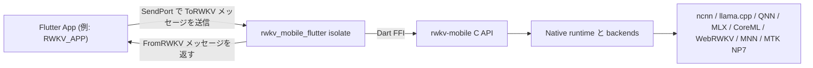

# rwkv_mobile_flutter

[](../LICENSE)
[](../README.md)
[](./README.zh-hans.md)
[](./README.zh-hant.md)
[](./README.ko.md)
[](./README.ru.md)

**Flutter アプリを `rwkv-mobile` 推論ランタイムへ接続します。**
**オンデバイス RWKV、マルチモーダル、音声ワークロード向けの Flutter FFI プラグイン兼ランタイム調停レイヤーです。**

`rwkv_mobile_flutter` は、Flutter App とネイティブの `rwkv-mobile` C++ inference engine の間に位置します。単なる薄い FFI binding ではなく、isolate の境界、リクエスト/レスポンスのプロトコル、モデルのライフサイクル、ネイティブライブラリの読み込み、さらに [RWKV_APP](https://github.com/RWKV-APP/RWKV_APP) のようなアプリで必要となる一部のランタイム調整も担います。

## なぜ rwkv_mobile_flutter なのか

- **Flutter ネイティブ統合向け：** アプリ側が生の FFI 呼び出しを直接扱わずに、Dart フレンドリーな形で native runtime を利用できます。
- **実機ワークロードを前提に設計：** 推論処理を UI isolate から分離し、モデル読み込み、生成、ビジョン、音声、TTS の流れを一箇所で調停します。
- **複数バックエンドを一つの橋で接続：** `rwkv-mobile` が提供する CPU、GPU、NPU バックエンドに対し、同じ Dart プロトコルを再利用できます。
- **配布を意識したパッケージング：** Android、iOS、macOS、Windows、Linux 向けの事前ビルド済みネイティブライブラリをプラグインに同梱できます。

## ✨ 主な機能

- **クロスプラットフォーム Flutter FFI プラグイン：** Android、iOS、macOS、Windows、Linux。
- **isolate ベースの runtime bridge：** 独立した Dart isolate の背後で native inference runtime を動かします。
- **構造化されたリクエスト/レスポンスプロトコル：** `ToRWKV` と `FromRWKV` の sealed classes を使ってアプリと runtime を接続します。
- **モデルライフサイクル管理：** Flutter 側から複数モデルの読み込み、解放、切り替え、照会ができます。
- **テキスト生成 API：** completion、履歴付き chat、batch inference、ポーリング型の停止/再開、token カウント。
- **マルチモーダル対応：** vision encoder、adapter ベースの画像処理フロー、Whisper 風 audio prompt をサポートします。
- **音声対応：** SparkTTS のモデル読み込み、ストリーミング TTS buffer、global tokens、属性ベース音声生成。
- **ランタイム診断：** 読み込み進捗、prefill/decode 速度、ログ、SoC/プラットフォーム検出、state cache 情報。

## 🧭 アーキテクチャ上の位置付け

このリポジトリは、3 層構成の中間レイヤーとして捉えるのが適切です。



- **アプリ層：** 製品 UI、状態管理、ダウンロード、業務ロジック。
- **この層：** isolate 境界、プロトコル、プラットフォームライブラリ読み込み、runtime 調停、Dart-facing API。
- **エンジン層：** C++ runtime、バックエンド実装、native inference、低レベル C API。

## 🚀 はじめに

### 依存関係を追加する

ローカル開発では、`RWKV_APP` は path dependency としてこのリポジトリを参照しています。

```yaml
dependencies:
  rwkv_mobile_flutter:
    path: ../rwkv_mobile_flutter
```

自分の Flutter アプリでも同じ方法で利用できますし、社内管理の Git リポジトリを指定しても構いません。

### runtime isolate を起動する

```dart
import 'dart:isolate';
import 'dart:ui';

import 'package:rwkv_mobile_flutter/rwkv.dart';

final receivePort = ReceivePort();

receivePort.listen((message) {
  if (message is SendPort) {
    // この SendPort を保存し、ToRWKV リクエスト送信に使います。
  } else {
    // ここで FromRWKV レスポンスを処理します。
  }
});

await RWKVMobile().runIsolate(
  StartOptions(
    sendPort: receivePort.sendPort,
    rootIsolateToken: RootIsolateToken.instance!,
  ),
);
```

### 型付きメッセージで通信する

Frontend isolate と RWKV isolate は `SendPort` を介して通信します。

- リクエスト定義: `lib/to_rwkv.dart`
- レスポンス定義: `lib/from_rwkv.dart`
- runtime bridge: `lib/rwkv_mobile_flutter.dart`

典型的な流れ:

1. RWKV isolate を起動する。
2. isolate から返される `SendPort` を受け取る。
3. `LoadRWKVModel`、`ChatAsync`、`GenerateAsync`、`StartTTS` などの型付きリクエストを送る。
4. `LoadModelSteps`、`ResponseBufferContent`、`Speed`、`TTSStreamingBuffer` などの型付きレスポンスを消費する。

## 🔌 プロトコル概要

公開されている Dart 側の契約は、主に 2 つの sealed hierarchy で構成されています。

### Frontend から runtime へ

```dart
sealed class ToRWKV {}
```

代表的なリクエスト:

- `LoadRWKVModel`
- `ReleaseRWKVModel`
- `ChatAsync`
- `ChatBatchAsync`
- `GenerateAsync`
- `GetResponseBufferContent`
- `LoadVisionEncoder`
- `LoadVisionEncoderAndAdapter`
- `LoadWhisperEncoder`
- `StartTTS`
- `SaveRuntimeStateByHistory`

### Runtime から frontend へ

```dart
sealed class FromRWKV {}
```

代表的なレスポンス:

- `LoadModelSteps`
- `GenerateStart`
- `GenerateStop`
- `ResponseBufferContent`
- `ResponseBatchBufferContent`
- `Speed`
- `EvaluationResults`
- `RuntimeLog`
- `StateInfo`
- `TTSStreamingBuffer`

## 🧩 ラップしているランタイム機能

このプラグインは、`rwkv-mobile` が公開する以下のランタイム機能をラップしています。

- `Backend` enum を介した複数バックエンド選択
- Chat / completion 推論
- Batch inference
- Sampling と penalty パラメータ制御
- Seed と prompt 管理
- Response buffer のポーリング
- Vision encoder の読み込み
- Whisper / audio prompt のサポート
- SparkTTS の読み込みとストリーミング生成
- Runtime state の保存と復元
- プラットフォームと SoC 情報の取得

Dart 層で表現されている backend:

- `ncnn`
- `llama.cpp`
- `web-rwkv`
- `qnn`
- `mnn`
- `coreml`
- `mlx`
- `mtk_np7`

実際に利用できるかどうかは、各プラットフォーム向けに同梱する native binaries に依存します。

## 📦 同梱されるネイティブライブラリ

このリポジトリには、各プラットフォーム向けの事前ビルド済み成果物が含まれています。例:

- Android: `android/src/main/jniLibs/arm64-v8a/librwkv_mobile.so`
- iOS: `ios/librwkv_mobile.a`
- macOS: `macos/librwkv_mobile.dylib`
- Windows: `windows/rwkv_mobile.dll`, `windows/rwkv_mobile-arm64.dll`
- Linux: `linux/librwkv_mobile-linux-x86_64.so`, `linux/librwkv_mobile-linux-aarch64.so`

プラグインは、現在のプラットフォームと ABI に応じて対応するネイティブライブラリを動的に読み込みます。

## 🔄 ネイティブライブラリを更新する

次のようなエラーが出る場合:

```text
Invalid argument(s): Failed to lookup symbol 'xxx': undefined symbol: xxx
```

同梱されている native libraries が、現在の FFI binding や下位の engine build とずれている可能性があります。最新の `rwkv-mobile` release から更新してください。

- Windows:

```powershell
& ./fetch_latest_libraries.ps1
```

- Linux / macOS:

```sh
./fetch_latest_libraries.sh
```

これらのスクリプトは `rwkv-mobile` の release から各プラットフォーム向けアーカイブを取得し、展開した成果物をこのプラグインリポジトリへコピーします。

## 💻 RWKV_APP と一緒に開発する

アプリ本体とこの bridge を同時に開発する場合は、2 つのリポジトリを同じ階層に置くのが便利です。

```text
parent/
├─ rwkv_mobile_flutter/
└─ RWKV_APP/
```

そのうえで、`RWKV_APP/pubspec.yaml` ではローカル path dependency を使います。

```yaml
dependencies:
  rwkv_mobile_flutter:
    path: ../rwkv_mobile_flutter
```

以前 `example/` にあった demo は、現在 [RWKV_APP](https://github.com/RWKV-APP/RWKV_APP) に移されています。

## 🏗️ 技術スタック

- **Flutter / Dart:** クロスプラットフォームのアプリ層と isolate モデル。
- **Dart FFI:** Flutter と C API をつなぐ native bridge。
- **rwkv_mobile_flutter:** プロトコル、ランタイム調停、プラットフォームパッケージング層。
- **rwkv-mobile:** 複数バックエンドとマルチモーダル対応を備えた native inference runtime。
- **プラットフォーム実行層:** backend とデバイス条件に応じて CPU、GPU、NPU 上で実行。

## 🤝 コントリビューションメモ

このリポジトリは、engine 層と app 層と歩調を合わせて進化させるのが最も自然です。

- native runtime symbol を変更した場合は、Dart FFI binding を更新または再生成してください。
- 新しい runtime capability を追加する場合は、`ToRWKV`、`FromRWKV`、isolate handler をまとめて更新するのが望ましいです。
- プラットフォームのパッケージングを変更する場合は、各 OS でのネイティブライブラリ配置も確認してください。

## 📄 ライセンス

このプロジェクトは Apache License 2.0 のもとで公開されています。詳細は [LICENSE](../LICENSE) を参照してください。

## 🔗 関連リンク

- [RWKV_APP](https://github.com/RWKV-APP/RWKV_APP)
- [rwkv-mobile](https://github.com/MollySophia/rwkv-mobile)
- [rwkv_mobile_flutter package entrypoint](../lib/rwkv.dart)
- [Typed requests](../lib/to_rwkv.dart)
- [Typed responses](../lib/from_rwkv.dart)
