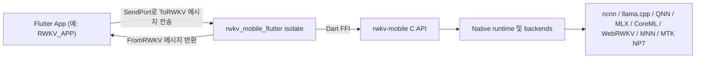

# rwkv_mobile_flutter

[](../LICENSE)
[](../README.md)
[](./README.zh-hans.md)
[](./README.zh-hant.md)
[](./README.ja.md)
[](./README.ru.md)

**Flutter 앱을 `rwkv-mobile` 추론 런타임에 연결합니다.**
**온디바이스 RWKV, 멀티모달, 음성 워크로드를 위한 Flutter FFI 플러그인 겸 런타임 조정 계층입니다.**

`rwkv_mobile_flutter`는 Flutter App과 네이티브 `rwkv-mobile` C++ inference engine 사이에 위치합니다. 단순한 얇은 FFI binding이 아니라, isolate 경계, 요청/응답 프로토콜, 모델 수명주기, 네이티브 라이브러리 로딩, 그리고 [RWKV_APP](https://github.com/RWKV-APP/RWKV_APP) 같은 앱에서 필요한 일부 런타임 조정까지 담당합니다.

## 왜 rwkv_mobile_flutter인가

- **Flutter 네이티브 통합에 적합:** 앱 코드가 원시 FFI 호출을 직접 다루지 않고도 Dart 친화적인 방식으로 native runtime을 사용할 수 있습니다.
- **실제 디바이스 워크로드 기준 설계:** 추론 작업을 UI isolate 바깥으로 분리하고, 모델 로딩, 생성, 비전, 오디오, TTS 흐름을 한곳에서 조정합니다.
- **여러 백엔드를 하나의 브리지로 연결:** `rwkv-mobile`이 제공하는 CPU, GPU, NPU 백엔드에 대해 동일한 Dart 프로토콜을 재사용할 수 있습니다.
- **배포를 고려한 패키징:** Android, iOS, macOS, Windows, Linux용 사전 빌드 네이티브 라이브러리를 플러그인에 포함할 수 있습니다.

## ✨ 핵심 기능

- **크로스플랫폼 Flutter FFI 플러그인:** Android, iOS, macOS, Windows, Linux.
- **isolate 기반 runtime bridge:** 독립적인 Dart isolate 뒤에서 native inference runtime을 실행합니다.
- **구조화된 요청/응답 프로토콜:** `ToRWKV`, `FromRWKV` sealed classes를 사용해 앱과 runtime을 연결합니다.
- **모델 수명주기 관리:** Flutter 측에서 여러 모델을 로드, 해제, 전환, 조회할 수 있습니다.
- **텍스트 생성 API:** completion, 히스토리 기반 chat, batch inference, 폴링 기반 stop/resume, token 카운팅.
- **멀티모달 지원:** vision encoder, adapter 기반 비전 흐름, Whisper 스타일 audio prompt 지원.
- **음성 지원:** SparkTTS 모델 로딩, 스트리밍 TTS buffer, global tokens, 속성 기반 음성 생성.
- **런타임 진단:** 로딩 진행률, prefill/decode 속도, 로그, SoC/플랫폼 감지, state cache 정보.

## 🧭 아키텍처 위치

이 저장소는 3계층 구조의 중간 계층으로 이해하는 것이 가장 적절합니다.



- **앱 계층:** 제품 UI, 상태 관리, 다운로드, 비즈니스 로직.
- **이 계층:** isolate 경계, 프로토콜, 플랫폼 라이브러리 로딩, runtime 조정, Dart-facing API 표면.
- **엔진 계층:** C++ runtime, backend 구현, native inference, 저수준 C API.

## 🚀 시작하기

### 의존성 추가

로컬 개발에서 `RWKV_APP`는 이 저장소를 path dependency로 사용합니다.

```yaml
dependencies:
  rwkv_mobile_flutter:
    path: ../rwkv_mobile_flutter
```

자신의 Flutter 앱에서도 같은 방식으로 사용할 수 있고, 내부 Git 저장소를 지정해도 됩니다.

### runtime isolate 시작

```dart
import 'dart:isolate';
import 'dart:ui';

import 'package:rwkv_mobile_flutter/rwkv.dart';

final receivePort = ReceivePort();

receivePort.listen((message) {
  if (message is SendPort) {
    // 이 SendPort를 저장하고 ToRWKV 요청 전송에 사용합니다.
  } else {
    // 여기서 FromRWKV 응답을 처리합니다.
  }
});

await RWKVMobile().runIsolate(
  StartOptions(
    sendPort: receivePort.sendPort,
    rootIsolateToken: RootIsolateToken.instance!,
  ),
);
```

### 타입이 있는 메시지로 통신

Frontend isolate와 RWKV isolate는 `SendPort`를 통해 통신합니다.

- 요청 정의: `lib/to_rwkv.dart`
- 응답 정의: `lib/from_rwkv.dart`
- runtime bridge: `lib/rwkv_mobile_flutter.dart`

일반적인 흐름:

1. RWKV isolate를 시작합니다.
2. isolate가 반환한 `SendPort`를 받습니다.
3. `LoadRWKVModel`, `ChatAsync`, `GenerateAsync`, `StartTTS` 같은 타입이 있는 요청을 보냅니다.
4. `LoadModelSteps`, `ResponseBufferContent`, `Speed`, `TTSStreamingBuffer` 같은 타입이 있는 응답을 소비합니다.

## 🔌 프로토콜 개요

공개된 Dart 측 계약은 크게 두 개의 sealed hierarchy로 구성됩니다.

### Frontend -> runtime

```dart
sealed class ToRWKV {}
```

대표적인 요청:

- `LoadRWKVModel`
- `ReleaseRWKVModel`
- `ChatAsync`
- `ChatBatchAsync`
- `GenerateAsync`
- `GetResponseBufferContent`
- `LoadVisionEncoder`
- `LoadVisionEncoderAndAdapter`
- `LoadWhisperEncoder`
- `StartTTS`
- `SaveRuntimeStateByHistory`

### Runtime -> frontend

```dart
sealed class FromRWKV {}
```

대표적인 응답:

- `LoadModelSteps`
- `GenerateStart`
- `GenerateStop`
- `ResponseBufferContent`
- `ResponseBatchBufferContent`
- `Speed`
- `EvaluationResults`
- `RuntimeLog`
- `StateInfo`
- `TTSStreamingBuffer`

## 🧩 래핑된 런타임 기능

이 플러그인은 `rwkv-mobile`이 노출하는 다음 런타임 기능을 감쌉니다.

- `Backend` enum을 통한 여러 backend 선택
- Chat / completion 추론
- Batch inference
- Sampling 및 penalty 파라미터 제어
- Seed 및 prompt 관리
- Response buffer 폴링
- Vision encoder 로딩
- Whisper / audio prompt 지원
- SparkTTS 로딩 및 스트리밍 생성
- Runtime state 저장 및 복원
- 플랫폼 및 SoC 정보 조회

Dart 계층에서 표현되는 backend:

- `ncnn`
- `llama.cpp`
- `web-rwkv`
- `qnn`
- `mnn`
- `coreml`
- `mlx`
- `mtk_np7`

실제 사용 가능 여부는 각 플랫폼용으로 함께 배포하는 native binaries에 따라 달라집니다.

## 📦 포함된 네이티브 라이브러리

이 저장소에는 여러 플랫폼용 사전 빌드 결과물이 포함되어 있습니다. 예:

- Android: `android/src/main/jniLibs/arm64-v8a/librwkv_mobile.so`
- iOS: `ios/librwkv_mobile.a`
- macOS: `macos/librwkv_mobile.dylib`
- Windows: `windows/rwkv_mobile.dll`, `windows/rwkv_mobile-arm64.dll`
- Linux: `linux/librwkv_mobile-linux-x86_64.so`, `linux/librwkv_mobile-linux-aarch64.so`

플러그인은 현재 플랫폼과 ABI에 맞는 네이티브 라이브러리를 동적으로 로드합니다.

## 🔄 네이티브 라이브러리 업데이트

다음과 같은 오류가 보이면:

```text
Invalid argument(s): Failed to lookup symbol 'xxx': undefined symbol: xxx
```

포함된 native libraries가 현재 FFI binding 또는 하위 engine build와 맞지 않을 가능성이 큽니다. 최신 `rwkv-mobile` release에서 다시 가져오세요.

- Windows:

```powershell
& ./fetch_latest_libraries.ps1
```

- Linux / macOS:

```sh
./fetch_latest_libraries.sh
```

이 스크립트들은 `rwkv-mobile` release에서 플랫폼별 아카이브를 내려받고, 압축을 푼 결과물을 이 플러그인 저장소로 복사합니다.

## 💻 RWKV_APP와 함께 개발하기

앱 본체와 이 bridge를 함께 개발한다면, 두 저장소를 같은 상위 디렉토리에 두는 것이 편합니다.

```text
parent/
├─ rwkv_mobile_flutter/
└─ RWKV_APP/
```

그 다음 `RWKV_APP/pubspec.yaml`에서 로컬 path dependency를 사용합니다.

```yaml
dependencies:
  rwkv_mobile_flutter:
    path: ../rwkv_mobile_flutter
```

이전에 `example/`에 있던 demo는 이제 [RWKV_APP](https://github.com/RWKV-APP/RWKV_APP)로 옮겨졌습니다.

## 🏗️ 스택

- **Flutter / Dart:** 크로스플랫폼 앱 계층과 isolate 모델.
- **Dart FFI:** Flutter와 C API를 연결하는 native bridge.
- **rwkv_mobile_flutter:** 프로토콜, 런타임 조정, 플랫폼 패키징 계층.
- **rwkv-mobile:** 여러 backend와 멀티모달 지원을 갖춘 native inference runtime.
- **플랫폼 실행 계층:** backend와 디바이스 조건에 따라 CPU, GPU, NPU에서 실행.

## 🤝 기여 메모

이 저장소는 engine 계층과 app 계층과 함께 맞춰서 진화시키는 것이 가장 자연스럽습니다.

- native runtime symbol을 변경했다면 Dart FFI binding을 갱신하거나 다시 생성해야 합니다.
- 새로운 runtime capability를 추가한다면 `ToRWKV`, `FromRWKV`, isolate handler를 함께 업데이트하는 것이 좋습니다.
- 플랫폼 패키징을 바꾼다면 각 OS에서의 네이티브 라이브러리 배치도 확인해야 합니다.

## 📄 라이선스

이 프로젝트는 Apache License 2.0에 따라 배포됩니다. 자세한 내용은 [LICENSE](../LICENSE)를 참고하세요.

## 🔗 관련 링크

- [RWKV_APP](https://github.com/RWKV-APP/RWKV_APP)
- [rwkv-mobile](https://github.com/MollySophia/rwkv-mobile)
- [rwkv_mobile_flutter package entrypoint](../lib/rwkv.dart)
- [Typed requests](../lib/to_rwkv.dart)
- [Typed responses](../lib/from_rwkv.dart)
