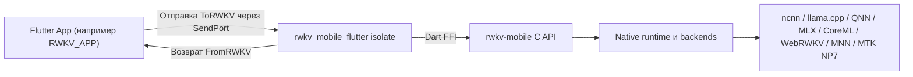

# rwkv_mobile_flutter

[](../LICENSE)
[](../README.md)
[](./README.zh-hans.md)
[](./README.zh-hant.md)
[](./README.ja.md)
[](./README.ko.md)

**Подключает Flutter-приложения к inference runtime `rwkv-mobile`.**
**Flutter FFI-плагин и слой оркестрации runtime для on-device RWKV, мультимодальности и голосовых сценариев.**

`rwkv_mobile_flutter` находится между Flutter App и нативным `rwkv-mobile` C++ inference engine. Это не просто тонкий FFI binding: слой также отвечает за границу isolate, протокол запросов/ответов, жизненный цикл моделей, загрузку нативных библиотек и часть runtime-координации, которая нужна приложениям вроде [RWKV_APP](https://github.com/RWKV-APP/RWKV_APP).

## Почему rwkv_mobile_flutter

- **Ориентирован на интеграцию с Flutter:** Позволяет использовать native runtime из Dart без прямой работы приложения с сырыми FFI-вызовами.
- **Рассчитан на реальные device workloads:** Выносит инференс из UI isolate и централизованно координирует загрузку моделей, генерацию, vision, audio и TTS.
- **Один мост для нескольких backend:** Повторно использует один и тот же Dart-протокол для CPU, GPU и NPU backend, которые предоставляет `rwkv-mobile`.
- **Практичная упаковка для поставки:** Распространяет предсобранные нативные библиотеки для Android, iOS, macOS, Windows и Linux прямо в составе плагина.

## ✨ Основные возможности

- **Кроссплатформенный Flutter FFI-плагин:** Android, iOS, macOS, Windows и Linux.
- **Isolate-based runtime bridge:** Запускает native inference runtime за выделенным Dart isolate.
- **Структурированный протокол запросов/ответов:** Использует `ToRWKV` и `FromRWKV` sealed classes для общения приложения с runtime.
- **Управление жизненным циклом моделей:** Загрузка, выгрузка, переключение и инспекция нескольких моделей из Flutter.
- **API для текстовой генерации:** Completion, chat с историей, batch inference, polling для stop/resume и подсчет token.
- **Поддержка мультимодальности:** Vision encoder, vision flow с adapter и Whisper-подобные audio prompt.
- **Поддержка речи:** Загрузка SparkTTS, потоковые TTS buffer, global tokens и генерация речи по свойствам.
- **Диагностика runtime:** Прогресс загрузки, скорости prefill/decode, логи, определение SoC/платформы и информация о state cache.

## 🧭 Место в архитектуре

Этот репозиторий лучше всего рассматривать как средний слой в трехуровневом стеке.



- **Слой приложения:** Продуктовый UI, state management, загрузки и бизнес-логика.
- **Этот слой:** Граница isolate, протокол, загрузка платформенных библиотек, оркестрация runtime и Dart-facing API.
- **Слой движка:** C++ runtime, реализации backend, native inference и низкоуровневый C API.

## 🚀 Быстрый старт

### Добавьте зависимость

В локальной разработке `RWKV_APP` использует этот репозиторий как path dependency:

```yaml
dependencies:
  rwkv_mobile_flutter:
    path: ../rwkv_mobile_flutter
```

Вы можете подключить его так же в своем Flutter-приложении или указать внутренний Git-репозиторий.

### Запустите runtime isolate

```dart
import 'dart:isolate';
import 'dart:ui';

import 'package:rwkv_mobile_flutter/rwkv.dart';

final receivePort = ReceivePort();

receivePort.listen((message) {
  if (message is SendPort) {
    // Сохраните этот SendPort и используйте его для отправки ToRWKV-запросов.
  } else {
    // Здесь обрабатывайте FromRWKV-ответы.
  }
});

await RWKVMobile().runIsolate(
  StartOptions(
    sendPort: receivePort.sendPort,
    rootIsolateToken: RootIsolateToken.instance!,
  ),
);
```

### Используйте типизированные сообщения

Frontend isolate и RWKV isolate взаимодействуют через `SendPort`:

- Описание запросов: `lib/to_rwkv.dart`
- Описание ответов: `lib/from_rwkv.dart`
- runtime bridge: `lib/rwkv_mobile_flutter.dart`

Типичный поток:

1. Запустить RWKV isolate.
2. Получить `SendPort`, который возвращает isolate.
3. Отправить типизированные запросы, например `LoadRWKVModel`, `ChatAsync`, `GenerateAsync` или `StartTTS`.
4. Обрабатывать типизированные ответы, например `LoadModelSteps`, `ResponseBufferContent`, `Speed` или `TTSStreamingBuffer`.

## 🔌 Обзор протокола

Публичный Dart-контракт строится вокруг двух sealed hierarchy.

### Frontend -> runtime

```dart
sealed class ToRWKV {}
```

Типичные запросы:

- `LoadRWKVModel`
- `ReleaseRWKVModel`
- `ChatAsync`
- `ChatBatchAsync`
- `GenerateAsync`
- `GetResponseBufferContent`
- `LoadVisionEncoder`
- `LoadVisionEncoderAndAdapter`
- `LoadWhisperEncoder`
- `StartTTS`
- `SaveRuntimeStateByHistory`

### Runtime -> frontend

```dart
sealed class FromRWKV {}
```

Типичные ответы:

- `LoadModelSteps`
- `GenerateStart`
- `GenerateStop`
- `ResponseBufferContent`
- `ResponseBatchBufferContent`
- `Speed`
- `EvaluationResults`
- `RuntimeLog`
- `StateInfo`
- `TTSStreamingBuffer`

## 🧩 Какие runtime-возможности оборачивает плагин

Этот плагин оборачивает возможности `rwkv-mobile`, включая:

- Выбор нескольких backend через `Backend` enum
- Chat / completion инференс
- Batch inference
- Управление sampling и penalty параметрами
- Управление seed и prompt
- Polling response buffer
- Загрузку vision encoder
- Поддержку Whisper / audio prompt
- Загрузку SparkTTS и потоковую генерацию
- Сохранение и восстановление runtime state
- Получение информации о платформе и SoC

Backend, представленные в Dart:

- `ncnn`
- `llama.cpp`
- `web-rwkv`
- `qnn`
- `mnn`
- `coreml`
- `mlx`
- `mtk_np7`

Фактическая доступность зависит от того, какие native binaries вы поставляете для каждой платформы.

## 📦 Встроенные нативные библиотеки

В этом репозитории уже есть предсобранные артефакты для поддерживаемых платформ, например:

- Android: `android/src/main/jniLibs/arm64-v8a/librwkv_mobile.so`
- iOS: `ios/librwkv_mobile.a`
- macOS: `macos/librwkv_mobile.dylib`
- Windows: `windows/rwkv_mobile.dll`, `windows/rwkv_mobile-arm64.dll`
- Linux: `linux/librwkv_mobile-linux-x86_64.so`, `linux/librwkv_mobile-linux-aarch64.so`

Плагин динамически загружает подходящую библиотеку в зависимости от текущей платформы и ABI.

## 🔄 Обновление нативных библиотек

Если вы видите ошибку вида:

```text
Invalid argument(s): Failed to lookup symbol 'xxx': undefined symbol: xxx
```

скорее всего, встроенные native libraries рассинхронизировались с текущими FFI binding или нижележащей сборкой engine. Обновите их из последнего release `rwkv-mobile`:

- Windows:

```powershell
& ./fetch_latest_libraries.ps1
```

- Linux / macOS:

```sh
./fetch_latest_libraries.sh
```

Эти скрипты скачивают последние платформенные архивы из release `rwkv-mobile` и копируют распакованные артефакты в текущий репозиторий плагина.

## 💻 Совместная разработка с RWKV_APP

Если вы разрабатываете полное Flutter-приложение и этот bridge одновременно, удобнее держать репозитории рядом:

```text
parent/
├─ rwkv_mobile_flutter/
└─ RWKV_APP/
```

После этого используйте локальную path dependency в `RWKV_APP/pubspec.yaml`:

```yaml
dependencies:
  rwkv_mobile_flutter:
    path: ../rwkv_mobile_flutter
```

Демо, которое раньше находилось в `example/`, перенесено в [RWKV_APP](https://github.com/RWKV-APP/RWKV_APP).

## 🏗️ Стек

- **Flutter / Dart:** Кроссплатформенный слой приложения и модель isolate.
- **Dart FFI:** Native bridge между Flutter и C API.
- **rwkv_mobile_flutter:** Слой протокола, оркестрации runtime и платформенного пакетирования.
- **rwkv-mobile:** Native inference runtime с несколькими backend и мультимодальной поддержкой.
- **Платформенный слой исполнения:** Выполнение на CPU, GPU или NPU в зависимости от backend и устройства.

## 🤝 Заметки для контрибьюторов

Этот репозиторий логично развивать синхронно со слоями engine и app:

- Если вы меняете native runtime symbol, нужно обновить или заново сгенерировать Dart FFI binding.
- Если вы добавляете новую runtime capability, лучше обновлять `ToRWKV`, `FromRWKV` и isolate handler вместе.
- Если вы меняете платформенное пакетирование, проверьте раскладку нативных библиотек на каждой целевой ОС.

## 📄 Лицензия

Проект распространяется по лицензии Apache License 2.0. Подробности см. в [LICENSE](../LICENSE).

## 🔗 Связанные ссылки

- [RWKV_APP](https://github.com/RWKV-APP/RWKV_APP)
- [rwkv-mobile](https://github.com/MollySophia/rwkv-mobile)
- [rwkv_mobile_flutter package entrypoint](../lib/rwkv.dart)
- [Typed requests](../lib/to_rwkv.dart)
- [Typed responses](../lib/from_rwkv.dart)
