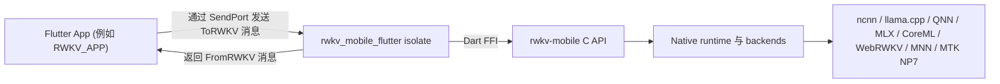

# rwkv_mobile_flutter

[](../LICENSE)
[](../README.md)
[](./README.zh-hant.md)
[](./README.ja.md)
[](./README.ko.md)
[](./README.ru.md)

**把 Flutter 应用连接到 `rwkv-mobile` 推理运行时。**
**一个面向端侧 RWKV、多模态与语音工作负载的 Flutter FFI 插件与运行时编排层。**

`rwkv_mobile_flutter` 位于 Flutter App 与原生 `rwkv-mobile` C++ inference engine 之间。它不只是薄薄一层 FFI binding，还负责 isolate 边界、请求/响应协议、模型生命周期、原生库加载，以及应用侧所需的一部分运行时协调工作，例如 [RWKV_APP](https://github.com/RWKV-APP/RWKV_APP)。

## 为什么选择 rwkv_mobile_flutter

- **面向 Flutter 原生集成：** 以 Dart 友好的方式暴露 native runtime，而不是让应用直接处理原始 FFI 调用。
- **面向真实设备工作负载：** 把推理工作移出 UI isolate，在一层里统一协调模型加载、生成、视觉、音频与 TTS 流程。
- **一层桥接多个后端：** 复用同一套 Dart 协议，对接 `rwkv-mobile` 提供的 CPU、GPU 与 NPU 后端。
- **更贴近交付的打包方式：** 直接随插件分发 Android、iOS、macOS、Windows 和 Linux 的预编译原生库。

## ✨ 核心功能

- **跨平台 Flutter FFI 插件：** Android、iOS、macOS、Windows 和 Linux。
- **基于 isolate 的 runtime bridge：** 在独立 Dart isolate 中托管 native inference runtime。
- **结构化请求/响应协议：** 使用 `ToRWKV` 与 `FromRWKV` sealed classes 进行应用与 runtime 通信。
- **模型生命周期管理：** 从 Flutter 侧加载、释放、切换并查询多个模型。
- **文本生成能力：** completion、带历史的 chat、batch inference、轮询式停止/恢复以及 token 计数。
- **多模态支持：** vision encoder、带 adapter 的视觉流程，以及 Whisper 风格的音频 prompt。
- **语音支持：** SparkTTS 模型加载、流式 TTS buffer、global tokens 与基于属性的语音生成。
- **运行时诊断：** 加载进度、prefill/decode 速度、日志、SoC/平台检测与 state cache 信息。

## 🧭 架构定位

这个仓库更适合被理解为三层结构中的中间层：



- **应用层：** 产品 UI、状态管理、下载与业务逻辑。
- **本层：** isolate 边界、协议、平台动态库加载、runtime 编排、Dart-facing API。
- **引擎层：** C++ runtime、后端实现、native inference 与底层 C API。

## 🚀 快速开始

### 添加依赖

在本地联调场景中，`RWKV_APP` 通过 path dependency 引用这个仓库：

```yaml
dependencies:
  rwkv_mobile_flutter:
    path: ../rwkv_mobile_flutter
```

你自己的 Flutter 应用也可以用同样方式接入，或者改成内部维护的 Git 仓库地址。

### 启动 runtime isolate

```dart
import 'dart:isolate';
import 'dart:ui';

import 'package:rwkv_mobile_flutter/rwkv.dart';

final receivePort = ReceivePort();

receivePort.listen((message) {
  if (message is SendPort) {
    // 保存这个 SendPort，并通过它发送 ToRWKV 请求。
  } else {
    // 在这里处理 FromRWKV 响应。
  }
});

await RWKVMobile().runIsolate(
  StartOptions(
    sendPort: receivePort.sendPort,
    rootIsolateToken: RootIsolateToken.instance!,
  ),
);
```

### 通过类型化消息通信

Frontend isolate 与 RWKV isolate 通过 `SendPort` 通讯：

- 请求定义：`lib/to_rwkv.dart`
- 响应定义：`lib/from_rwkv.dart`
- runtime bridge：`lib/rwkv_mobile_flutter.dart`

典型流程如下：

1. 启动 RWKV isolate。
2. 接收 isolate 返回的 `SendPort`。
3. 发送 `LoadRWKVModel`、`ChatAsync`、`GenerateAsync`、`StartTTS` 等类型化请求。
4. 消费 `LoadModelSteps`、`ResponseBufferContent`、`Speed`、`TTSStreamingBuffer` 等类型化响应。

## 🔌 协议概览

公开的 Dart 侧契约主要由两组 sealed hierarchy 组成：

### Frontend 到 runtime

```dart
sealed class ToRWKV {}
```

典型请求包括：

- `LoadRWKVModel`
- `ReleaseRWKVModel`
- `ChatAsync`
- `ChatBatchAsync`
- `GenerateAsync`
- `GetResponseBufferContent`
- `LoadVisionEncoder`
- `LoadVisionEncoderAndAdapter`
- `LoadWhisperEncoder`
- `StartTTS`
- `SaveRuntimeStateByHistory`

### Runtime 到 frontend

```dart
sealed class FromRWKV {}
```

典型响应包括：

- `LoadModelSteps`
- `GenerateStart`
- `GenerateStop`
- `ResponseBufferContent`
- `ResponseBatchBufferContent`
- `Speed`
- `EvaluationResults`
- `RuntimeLog`
- `StateInfo`
- `TTSStreamingBuffer`

## 🧩 已封装的运行时能力

这个插件封装了 `rwkv-mobile` 暴露出的运行时能力，包括：

- 通过 `Backend` enum 选择不同 backend
- Chat / completion 推理
- Batch inference
- Sampling 与 penalty 参数控制
- Seed 与 prompt 管理
- Response buffer 轮询
- Vision encoder 加载
- Whisper / audio prompt 支持
- SparkTTS 加载与流式生成
- Runtime state 保存与恢复
- 平台与 SoC 信息获取

Dart 层当前已表示的 backend 包括：

- `ncnn`
- `llama.cpp`
- `web-rwkv`
- `qnn`
- `mnn`
- `coreml`
- `mlx`
- `mtk_np7`

实际可用性取决于你为不同平台打包了哪些 native binaries。

## 📦 已打包的原生库

这个仓库已经包含了多平台的预编译产物，例如：

- Android：`android/src/main/jniLibs/arm64-v8a/librwkv_mobile.so`
- iOS：`ios/librwkv_mobile.a`
- macOS：`macos/librwkv_mobile.dylib`
- Windows：`windows/rwkv_mobile.dll`、`windows/rwkv_mobile-arm64.dll`
- Linux：`linux/librwkv_mobile-linux-x86_64.so`、`linux/librwkv_mobile-linux-aarch64.so`

插件会根据当前平台与 ABI 动态加载对应的原生库。

## 🔄 更新原生库

当你看到类似下面的错误时：

```text
Invalid argument(s): Failed to lookup symbol 'xxx': undefined symbol: xxx
```

通常意味着仓库内打包的 native libraries 与当前 FFI binding 或底层 engine build 不一致。可以从最新的 `rwkv-mobile` release 刷新这些库：

- Windows：

```powershell
& ./fetch_latest_libraries.ps1
```

- Linux / macOS：

```sh
./fetch_latest_libraries.sh
```

这些脚本会从 `rwkv-mobile` 的 release 下载最新平台压缩包，并把解压后的产物复制到当前插件仓库中。

## 💻 与 RWKV_APP 联调开发

如果你要同时开发完整 Flutter App 和这层 bridge，建议把两个仓库放在同一层目录：

```text
parent/
├─ rwkv_mobile_flutter/
└─ RWKV_APP/
```

然后在 `RWKV_APP/pubspec.yaml` 中使用本地 path dependency：

```yaml
dependencies:
  rwkv_mobile_flutter:
    path: ../rwkv_mobile_flutter
```

此前放在 `example/` 中的 demo 已迁移到 [RWKV_APP](https://github.com/RWKV-APP/RWKV_APP)。

## 🏗️ 技术栈

- **Flutter / Dart：** 跨平台应用层与 isolate 模型。
- **Dart FFI：** Flutter 与 C API 之间的 native bridge。
- **rwkv_mobile_flutter：** 协议、运行时编排与平台打包层。
- **rwkv-mobile：** 带多后端与多模态能力的 native inference runtime。
- **平台执行层：** 依据 backend 与设备条件运行在 CPU、GPU 或 NPU 上。

## 🤝 贡献说明

这个仓库最适合与 engine 层和 app 层保持同步演进：

- 如果你修改了 native runtime symbol，需要同步更新或重新生成 Dart FFI binding。
- 如果你新增了 runtime capability，最好同时更新 `ToRWKV`、`FromRWKV` 和 isolate handler。
- 如果你调整了平台打包方式，需要核对各目标 OS 下原生库的目录布局。

## 📄 License

本项目使用 Apache License 2.0。详情请见 [LICENSE](../LICENSE)。

## 🔗 相关链接

- [RWKV_APP](https://github.com/RWKV-APP/RWKV_APP)
- [rwkv-mobile](https://github.com/MollySophia/rwkv-mobile)
- [rwkv_mobile_flutter package entrypoint](../lib/rwkv.dart)
- [Typed requests](../lib/to_rwkv.dart)
- [Typed responses](../lib/from_rwkv.dart)
