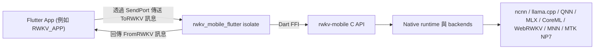

# rwkv_mobile_flutter

[](../LICENSE)
[](../README.md)
[](./README.zh-hans.md)
[](./README.ja.md)
[](./README.ko.md)
[](./README.ru.md)

**將 Flutter 應用連接到 `rwkv-mobile` 推理執行環境。**
**一個面向端側 RWKV、多模態與語音工作負載的 Flutter FFI 外掛與執行環境編排層。**

`rwkv_mobile_flutter` 位於 Flutter App 與原生 `rwkv-mobile` C++ inference engine 之間。它不只是薄薄一層 FFI binding，還負責 isolate 邊界、請求/回應協議、模型生命週期、原生庫載入，以及應用側所需的一部分執行環境協調工作，例如 [RWKV_APP](https://github.com/RWKV-APP/RWKV_APP)。

## 為什麼選擇 rwkv_mobile_flutter

- **面向 Flutter 原生整合：** 以 Dart 友善的方式暴露 native runtime，而不是讓應用直接處理原始 FFI 呼叫。
- **面向真實裝置工作負載：** 把推理工作移出 UI isolate，在同一層中統一協調模型載入、生成、視覺、音訊與 TTS 流程。
- **一層橋接多個後端：** 重用同一套 Dart 協議，對接 `rwkv-mobile` 提供的 CPU、GPU 與 NPU 後端。
- **更貼近交付的打包方式：** 直接隨外掛分發 Android、iOS、macOS、Windows 和 Linux 的預編譯原生庫。

## ✨ 核心功能

- **跨平台 Flutter FFI 外掛：** Android、iOS、macOS、Windows 和 Linux。
- **基於 isolate 的 runtime bridge：** 在獨立 Dart isolate 中託管 native inference runtime。
- **結構化請求/回應協議：** 使用 `ToRWKV` 與 `FromRWKV` sealed classes 進行應用與 runtime 通訊。
- **模型生命週期管理：** 從 Flutter 側載入、釋放、切換並查詢多個模型。
- **文字生成能力：** completion、帶歷史的 chat、batch inference、輪詢式停止/恢復以及 token 計數。
- **多模態支援：** vision encoder、帶 adapter 的視覺流程，以及 Whisper 風格的音訊 prompt。
- **語音支援：** SparkTTS 模型載入、串流 TTS buffer、global tokens 與基於屬性的語音生成。
- **執行環境診斷：** 載入進度、prefill/decode 速度、日誌、SoC/平台偵測與 state cache 資訊。

## 🧭 架構定位

這個倉庫更適合被理解為三層結構中的中間層：



- **應用層：** 產品 UI、狀態管理、下載與業務邏輯。
- **本層：** isolate 邊界、協議、平台動態庫載入、runtime 編排、Dart-facing API。
- **引擎層：** C++ runtime、後端實作、native inference 與底層 C API。

## 🚀 快速開始

### 新增依賴

在本機聯調場景中，`RWKV_APP` 透過 path dependency 引用這個倉庫：

```yaml
dependencies:
  rwkv_mobile_flutter:
    path: ../rwkv_mobile_flutter
```

你自己的 Flutter 應用也可以用相同方式接入，或改成內部維護的 Git 倉庫位址。

### 啟動 runtime isolate

```dart
import 'dart:isolate';
import 'dart:ui';

import 'package:rwkv_mobile_flutter/rwkv.dart';

final receivePort = ReceivePort();

receivePort.listen((message) {
  if (message is SendPort) {
    // 儲存這個 SendPort，並透過它傳送 ToRWKV 請求。
  } else {
    // 在這裡處理 FromRWKV 回應。
  }
});

await RWKVMobile().runIsolate(
  StartOptions(
    sendPort: receivePort.sendPort,
    rootIsolateToken: RootIsolateToken.instance!,
  ),
);
```

### 透過型別化訊息通訊

Frontend isolate 與 RWKV isolate 透過 `SendPort` 通訊：

- 請求定義：`lib/to_rwkv.dart`
- 回應定義：`lib/from_rwkv.dart`
- runtime bridge：`lib/rwkv_mobile_flutter.dart`

典型流程如下：

1. 啟動 RWKV isolate。
2. 接收 isolate 回傳的 `SendPort`。
3. 傳送 `LoadRWKVModel`、`ChatAsync`、`GenerateAsync`、`StartTTS` 等型別化請求。
4. 消費 `LoadModelSteps`、`ResponseBufferContent`、`Speed`、`TTSStreamingBuffer` 等型別化回應。

## 🔌 協議概覽

公開的 Dart 側契約主要由兩組 sealed hierarchy 組成：

### Frontend 到 runtime

```dart
sealed class ToRWKV {}
```

典型請求包括：

- `LoadRWKVModel`
- `ReleaseRWKVModel`
- `ChatAsync`
- `ChatBatchAsync`
- `GenerateAsync`
- `GetResponseBufferContent`
- `LoadVisionEncoder`
- `LoadVisionEncoderAndAdapter`
- `LoadWhisperEncoder`
- `StartTTS`
- `SaveRuntimeStateByHistory`

### Runtime 到 frontend

```dart
sealed class FromRWKV {}
```

典型回應包括：

- `LoadModelSteps`
- `GenerateStart`
- `GenerateStop`
- `ResponseBufferContent`
- `ResponseBatchBufferContent`
- `Speed`
- `EvaluationResults`
- `RuntimeLog`
- `StateInfo`
- `TTSStreamingBuffer`

## 🧩 已封裝的執行環境能力

這個外掛封裝了 `rwkv-mobile` 暴露出的執行環境能力，包括：

- 透過 `Backend` enum 選擇不同 backend
- Chat / completion 推理
- Batch inference
- Sampling 與 penalty 參數控制
- Seed 與 prompt 管理
- Response buffer 輪詢
- Vision encoder 載入
- Whisper / audio prompt 支援
- SparkTTS 載入與串流生成
- Runtime state 儲存與恢復
- 平台與 SoC 資訊取得

Dart 層目前已表示的 backend 包括：

- `ncnn`
- `llama.cpp`
- `web-rwkv`
- `qnn`
- `mnn`
- `coreml`
- `mlx`
- `mtk_np7`

實際可用性取決於你為不同平台打包了哪些 native binaries。

## 📦 已打包的原生庫

這個倉庫已經包含了多平台的預編譯產物，例如：

- Android：`android/src/main/jniLibs/arm64-v8a/librwkv_mobile.so`
- iOS：`ios/librwkv_mobile.a`
- macOS：`macos/librwkv_mobile.dylib`
- Windows：`windows/rwkv_mobile.dll`、`windows/rwkv_mobile-arm64.dll`
- Linux：`linux/librwkv_mobile-linux-x86_64.so`、`linux/librwkv_mobile-linux-aarch64.so`

外掛會根據當前平台與 ABI 動態載入對應的原生庫。

## 🔄 更新原生庫

當你看到類似下面的錯誤時：

```text
Invalid argument(s): Failed to lookup symbol 'xxx': undefined symbol: xxx
```

通常代表倉庫內打包的 native libraries 與當前 FFI binding 或底層 engine build 不一致。可以從最新的 `rwkv-mobile` release 刷新這些庫：

- Windows：

```powershell
& ./fetch_latest_libraries.ps1
```

- Linux / macOS：

```sh
./fetch_latest_libraries.sh
```

這些腳本會從 `rwkv-mobile` 的 release 下載最新平台壓縮包，並把解壓後的產物複製到目前外掛倉庫中。

## 💻 與 RWKV_APP 聯調開發

如果你要同時開發完整 Flutter App 與這層 bridge，建議把兩個倉庫放在同一層目錄：

```text
parent/
├─ rwkv_mobile_flutter/
└─ RWKV_APP/
```

然後在 `RWKV_APP/pubspec.yaml` 中使用本機 path dependency：

```yaml
dependencies:
  rwkv_mobile_flutter:
    path: ../rwkv_mobile_flutter
```

先前放在 `example/` 中的 demo 已遷移到 [RWKV_APP](https://github.com/RWKV-APP/RWKV_APP)。

## 🏗️ 技術棧

- **Flutter / Dart：** 跨平台應用層與 isolate 模型。
- **Dart FFI：** Flutter 與 C API 之間的 native bridge。
- **rwkv_mobile_flutter：** 協議、執行環境編排與平台打包層。
- **rwkv-mobile：** 具備多後端與多模態能力的 native inference runtime。
- **平台執行層：** 依據 backend 與裝置條件運行在 CPU、GPU 或 NPU 上。

## 🤝 貢獻說明

這個倉庫最適合與 engine 層和 app 層保持同步演進：

- 如果你修改了 native runtime symbol，需要同步更新或重新生成 Dart FFI binding。
- 如果你新增了 runtime capability，最好同時更新 `ToRWKV`、`FromRWKV` 和 isolate handler。
- 如果你調整了平台打包方式，需要核對各目標 OS 下原生庫的目錄配置。

## 📄 License

本專案使用 Apache License 2.0。詳情請見 [LICENSE](../LICENSE)。

## 🔗 相關連結

- [RWKV_APP](https://github.com/RWKV-APP/RWKV_APP)
- [rwkv-mobile](https://github.com/MollySophia/rwkv-mobile)
- [rwkv_mobile_flutter package entrypoint](../lib/rwkv.dart)
- [Typed requests](../lib/to_rwkv.dart)
- [Typed responses](../lib/from_rwkv.dart)
